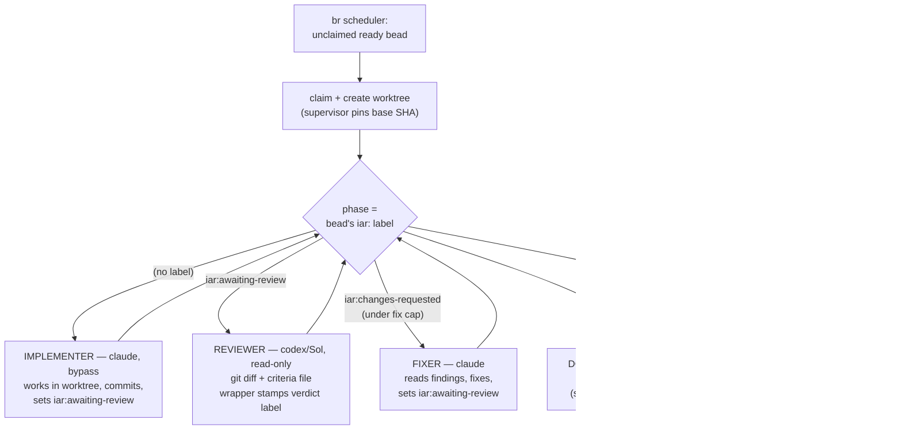

# The IAR Swarm

A self-assigning **implement-and-review** pipeline. Beads (tracker tickets) are
claimed, implemented by Claude, reviewed cross-model by Sol/codex, fixed if
needed, and marked approved — unattended, in isolated git worktrees, sized for
one operator watching a handful of beads at a time.

Nothing lands in `main` on its own: approved work is left as a branch for you to
merge. Nothing runs unless you or a claimed bead triggers it (no idle LLM cost).

---

## How it works

### It's a phase machine, not a one-shot

A single headless `claude -p` session **cannot** run the whole
implement→review→fix→close loop: a print-mode session dies when the model yields,
so it can't wait on an asynchronous reviewer. So each phase is its **own
short-lived process**, and `swarm-supervisor.sh` advances one phase per tick by
reading the bead's **Beads label**.

Why labels are the control signal, not free text: `br` reads are reliable and
atomic. Human-readable context (review request, verdict, escalation) is recorded
as `br comments` on the Bead itself — one store, no Agent Mail to keep in sync (a
wrong mail read returns empty == "no review yet" == respawn forever, silent token
burn). The supervisor authors nothing; it reads a label, spawns the right agent,
and each agent sets the next label on exit.



### The phase labels (single source of truth)

| Label | Meaning | Set by |
|---|---|---|
| *(none)* on a claimed bead | needs implementing | — |
| `iar:awaiting-review` | implemented, ready to review | implementer / fixer |
| `iar:approved` | review passed — you open a draft PR (`swarm p`) | reviewer's launch wrapper |
| `iar:changes-requested` | review found issues | reviewer's launch wrapper |
| `needs-human` | escalated, or a cap was hit — held | escalating agent, or supervisor |
| `needs-fable` | escalation is **structural** — `swarm` marks it 🧠, open Fable with `f` | escalating agent (optional) |

### The three agents

- **Implementer** — `claude -p` (bypass mode) in the worktree. Reads the bead +
  acceptance criteria, implements the smallest complete solution, runs tests via
  `iar-run-tests.sh`, commits to the branch, posts a `REVIEW REQUEST` comment on
  the bead (for your record), and sets `iar:awaiting-review`.
- **Reviewer** — `codex exec -m gpt-5.6-sol -s read-only`, cross-model. The
  read-only sandbox blocks the file locks `br` and CASS need, so the **supervisor**
  captures the acceptance criteria into a file and the reviewer judges the
  `git diff base..HEAD` + files only. It ends with `VERDICT: APPROVED` or
  `VERDICT: CHANGES REQUESTED`; its launch wrapper (outside the sandbox) stamps
  the matching label.
- **Fixer** — same as the implementer, but reads the reviewer's findings first
  and addresses only the actionable ones.

### Safety rails

- **Worktree isolation** — the supervisor creates `.claude/worktrees/iar-<bead>`
  on the branch `u/tfriedman/iar-<bead>` and pins the base SHA, so agents work in
  a sandbox and can't edit live tooling in place.
- **Per-phase attempt cap** (`PHASE_CAP`, default 2) — an agent that exits without
  advancing its label (exit-0-but-incomplete) is retried up to the cap, then the
  bead goes to `needs-human`. No infinite respawn.
- **Fix-cycle cap** (`FIX_CAP`, default 2) — after N review→changes cycles the bead
  goes to `needs-human` instead of looping.
- **Escalation gate** — a blocked agent posts an `ESCALATION` comment on the bead
  and sets `needs-human`; the bead holds (a held claim is never re-spawned) until
  you clear the label.
- **No auto-merge** — `iar:approved` is terminal for the swarm; you open a draft PR (`swarm p`) and merge on GitHub.
- **Bypass + DCG** — agents run ungated (`--permission-mode bypassPermissions`)
  because a scoped allowlist is brittle; the fence is the [Destructive Command
  Guard](https://github.com/Dicklesworthstone/destructive_command_guard), a
  PreToolUse hook that hard-blocks catastrophic commands (`rm -rf`, force-push,
  `DROP TABLE`, …) before they run — proven to fire even under bypass.

---

## How to use it

### Prerequisites

- `br` (Beads) with `BEADS_DIR=/Users/tal/.local/share/beads/precog/.beads`
- `claude`, `codex`, `jq`, `git` on `PATH`
- DCG installed (`brew install dicklesworthstone/tap/dcg`) — the safety hook

### 1 · Run one bead through review (interactive, no swarm)

Best when you want to watch a single task and are present to approve. In a Claude
session:

```
run precog-x8q through implement-and-review
```

### 2 · Turn on the swarm (self-assigning)

```bash
swarm on                             # start the poller (alias for swarm-supervisor.sh)
DRY_RUN=1 swarm-supervisor.sh once   # show what it WOULD claim, mutate nothing (self-check)
swarm-supervisor.sh once             # one tick: claim + advance one phase, then exit
swarm-supervisor.sh                  # loop forever, polling every POLL_SECS
```

The loop claims ready beads up to `MAX_INFLIGHT` and drives each through its
phases. It burns real tokens per pipeline — start with `once` (or a low cap) the
first time.

### 3 · Watch and act — the `swarm` cockpit

`swarm` is the one surface for both: a live fzf TUI that auto-refreshes AND acts.

```bash
swarm            # live TUI: auto-refreshing dashboard + one-key actions
swarm status     # one-shot text snapshot (swarm-status.sh)
```

It lists what's in flight / needs you / is approved / has a PR open, refreshes every
few seconds, previews the selected bead's detail + comments, and its header shows
whether the poller is running. Act with one key — **no hand-typed `br`/`git`**:

| Key | Does |
|---|---|
| `enter` | full detail + comments |
| `a` | answer an escalation (type decision → records note + resumes) |
| `f` | **Fable chat** — for hard/structural ones: opens a live `claude --model claude-fable-5` session on the bead in a **new `herdr` tab** (`herdr tab create` + `herdr agent start`; TUI keeps running). Talk it through, then hand back (`br update --remove-label needs-human`) or fix + set `iar:awaiting-review`. |
| `p` | open a **draft PR** for an approved bead (confirm → push → `gh pr create --draft --base main` → record URL on the bead). Never a local merge. |
| `d` | **done** — after the PR merges, tidy up: close bead + remove worktree + delete local branch |
| `c` / `r` | close / resume (drop `needs-human`) |

Same actions as one-shot verbs: `swarm answer <bead> "…"`, `swarm chat <bead>`,
`swarm pr <bead>`, `swarm done <bead>`, `swarm close <bead>`, `swarm resume <bead>`,
`swarm add "…"`. The list is priority-sorted with `⚠ needs-you` in red at the top.

### 4 · Handle an escalation (what the `a` key does)

An agent hit something only you can decide, or a phase hit its cap. It's tagged
`needs-human` and held, and the reason is the bead's latest comment (an
`ESCALATION` note the agent or supervisor wrote). The comment is a **record, not
a channel** — the agent has already exited. **You respond through the Bead**,
which the next agent reads via `br show`. The `swarm` TUI's `a` key does exactly this:

**A — decide and hand it back to the swarm:**
```bash
br update <bead> --notes "<your decision / instructions>"   # next agent reads this
br update <bead> --remove-label needs-human                 # drops the gate → supervisor resumes
```
The supervisor still owns the bead and resumes it at whatever phase its `iar:`
label says, in the existing worktree. If a cap put it there, also clear that
phase's counter under `/tmp/swarm-logs/`. (For an enforced directive rather than
a note, `--agent-context '<json>'` is the governing-instructions channel.)

**B — resolve it yourself, no agent needed** (answer is "close it" / "I'll handle it"):
```bash
br close <bead>
git -C <repo> worktree remove --force .claude/worktrees/iar-<bead>
```

### 5 · Ship approved work as a draft PR

`iar:approved` is terminal for the swarm. In the TUI press `p` (or `swarm pr <bead>`):
it pushes `u/tfriedman/iar-<bead>`, opens a **draft PR** against `main`, records the
URL on the bead, and relabels it `pr-open`. You review + merge on GitHub — the swarm
never merges into `main` locally.

```bash
swarm pr <bead>     # push branch + gh pr create --draft --base main
```

### Config knobs (environment variables)

| Var | Default | Meaning |
|---|---|---|
| `MAX_INFLIGHT` | 3 | max concurrently-owned beads |
| `POLL_SECS` | 60 | loop poll interval |
| `PHASE_CAP` | 2 | spawn attempts per phase before `needs-human` |
| `FIX_CAP` | 2 | review→changes cycles before `needs-human` |
| `ACTOR` | `swarm-<host>-<pid>` | claim identity (assignee + audit trail) |
| `LOG_DIR` | `/tmp/swarm-logs` | per-bead logs + phase/attempt state files |
| `REPO` | `/Users/tal/Documents/precog` | repo the worktrees branch from |
| `BEADS_DIR` | precog `.beads` | Beads store |
| `DRY_RUN` | 0 | `1` = print intended actions, mutate nothing |

---

## The pieces

| File | Role |
|---|---|
| `~/.local/bin/swarm` | **the cockpit** — live fzf TUI (monitor + one-key actions) + verbs |
| `~/.local/bin/swarm-supervisor.sh` | the phase machine (poller); `swarm on` starts it |
| `~/.local/bin/swarm-status.sh` | read-only text snapshot (`swarm status`) |
| `~/.local/bin/iar-run-tests.sh` | worktree-aware pytest runner (right venv/PYTHONPATH, no bazel, stdin closed) |
| `~/.claude/skills/implement-and-review/` | the skill (interactive single-bead runs) + `protocol.md` |
| `~/.config/sketchybar/plugins/overseerMail.sh` | `needs-human` count widget (read-only `br`) |
| DCG (`dcg`) | PreToolUse destructive-command guard |

---

## Known limits (deliberate)

- **No auto-merge** — you merge approved branches. The line stays until you trust it.
- **Single machine** — one poller, one host; no cross-machine coordination.
- **No push notifications** — escalations surface via sketchybar / `swarm-status.sh`,
  not your phone. A webhook off a `needs-human` poll is the deferred upgrade.
- **Resume re-runs the current phase** — a resumed bead restarts its phase from the
  top, not mid-thought; completed phases aren't redone.
- **Out-of-repo beads don't fit** — a task whose deliverable lives outside the repo
  (e.g. editing `~/.claude` tooling) can't be done in a worktree; it will thrash its
  attempts and escalate. Run those interactively.

## Why it's built this way (hard-won)

Getting the headless review phase to run at all shook out five real bugs, each
caught by the phase machine's rails rather than an infinite loop:

1. `codex exec` reads stdin even with a prompt arg → pass `< /dev/null` or it hangs.
2. codex echoes the prompt (which names both verdicts) → parse the **last**
   `VERDICT:` line, not the first.
3. `codex -s read-only` can't acquire the locks `br`/CASS need → reviewer gets
   criteria via a file and judges the diff only; the label is stamped outside the
   sandbox.
4. Injecting criteria text into a shell-quoted prompt breaks on embedded quotes →
   pass a file path, never the text.
5. Under `set -euo pipefail`, a bare `return` after a false `&&` test propagated
   exit 1 and killed the caller → explicit `return 0` in `load_worktree`.

See the `swarm-supervisor-phase-machine` memory for the condensed version.
